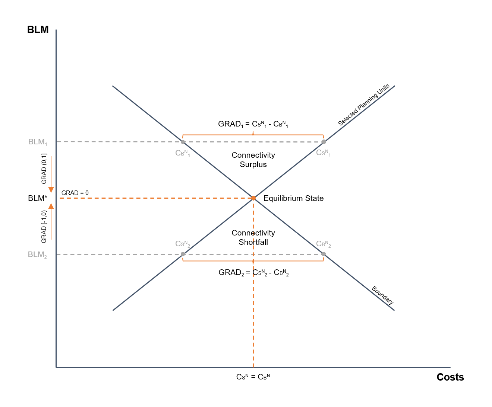

# eBLM: Equilibrium Boundary Length Modifier 

*eBLM* is an attempt to estimate (or approximate) the value of the Boundary Length Modifier (BLM) that balances the costs of selected planning units ($C_S$) and the boundary costs ($C_B$) of the Minimum Set Reserve Design Problem, hereinafter referred to as *Equilibrium Boundary Length Modifier* (BLM*). As the magnitudes of the costs are often different, to balance the costs it is necessary to apply normalization techniques ($N$). A balance between costs, called *Equilibrium State* (*i.e.*, when $C_S^N = C_B^N$), assumes that there is neither a “shortfall” nor a “surplus” of connectivity (see **Fig. 1**). Any variation from the value of the BLM* would break the *Equilibrium State*. For example, an increase from the value of the BLM* could improve spatial compactness, which would reduce CBN, but could increase CSN, resulting in a connectivity surplus (see $BLM_1$ in **Fig. 1**). The BLM* corresponds to a non-dominated point on the Pareto-optimal curve, which represents the *trade-off* between the two opposing objectives (*minimizing* $C_S$ vs *minimizing* $C_B$). This value is particularly important since it is a sensitive point, called *Knee Point*, due to small variations from the BLM* value could produce large changes in spatial compactness, but from which the costs of increasing the value of the BLM would not correspond to the improvements in connectivity. *eBLM* aims to find such turning point from which one objective begins to be prioritized over the other, in order to value the *trade-off* between $C_S$ and $C_B$ to answer the question: **how much it costs to increase or decrease connectivity?**

To demonstrate the approach, the decision support tool for Systematic Conservation Planning (SCP) called Marxan is used. This approach uses as a starting point the value of BLM obtained by the method proposed by [Cohon et al. (1979)][1], later adapted by [Fisher & Church (2005)][2] for its application in SCP. By identifying the endpoints of the *trade-off* curve between CS and CB, the absolute value of the slope of the line passing through both points is calculated, which is considered an estimate of the BLM* (see section **8.3.5** of the [Marxan Manual of Good Practice][3] for details of the method). However, the certainty of this estimation is not guaranteed. To determine if that BLM value is below or above the BLM*, as well as assess how far (or how close) it is from the BLM*, a measure called GRAD is presented. GRAD correspond to the difference between the normalized costs of selected planning units ($C_S^N$) and the normalized boundary costs ($C_B^N$) through the *Min-Max* technique. Therefore, since the minimum and maximum value that $C_S^N$ or $C_B^N$ can reach is $0$ and $1$, respectively, the value of GRAD ranges between $-1$ and $1$. The sign of GRAD indicates the direction in which the algorithm should adjust the BLM value (by adding, if GRAD $< 0$, or subtracting, if GRAD $> 0$, one unit to the first significant figure) to approximate the BLM*; the algorithm stops when the sign of GRAD changes, selecting the best BLM value (*i.e.*, the lowest GRAD value). Given that BLM* corresponds to an ideal state, since the costs would hardly be equal (*i.e.*, GRAD would never be $0$), eBLM aims to find a value of BLM as close as possible to this ideal point that minimizes the difference between the normalized costs, referred to as ~BLM*. In summary, GRAD works as a guide to adjust the BLM value toward the BLM* point, which represents the optimal balance between both objectives.



**Fig. 1**. Schematic graph of *Equilibrium Boundary Length Modifier* (BLM*).

## Requirements

*eBLM* uses the Marxan Program Executable (Marxan_x64.exe), as well as some of the Marxan Input/Ouput Files, to estimate the ~BLM*.

**Marxan Input Files**
- Input Parameter File (input.dat)
- Planning Unit File (./input/pu.dat)

**Marxan Output Files**
- Screen Log File (./output/output_log.dat)
- Summary Information (./output/output_sum.csv)
- Best Solution (./output/output_best.csv)

Make sure the required files are in the correct <ins>folder</ins>, with the correct <ins>name</ins>, and in the correct <ins>format</ins>. The name and format of the Marxan Output Files can be changed in "Save Files" of the Input Parameter File (input.dat). For more details, see the [User Manual MARXAN][4], section **5.3.1.9**.

## Usage

*eBLM* can be launched by clicking on eBLM.exe.

- Download eBLM.exe.
- Copy the executable on the same folder that contains the Marxan Program Executable (Marxan_x64.exe), as well as the Marxan Input/Output Files.

Since Marxan is based on heuristic methods, it does not always provide the same (or the best) solutions, so it is strongly recommended to run the executable several times to estimate the final value of the ~BLM*. Users are also encouraged to modify the “Annealing Parameters” or any other parameter of the Input Parameter File (input.dat) that helps to obtain better solutions (*i.e.*, better local optima), to more accurately estimate the value of the ~BLM* (see **Appendix B-2** of the [User Manual MARXAN][4] or section **8.3.2** of the [Marxan Good Practices Handbook][3] for some suggestions).

## Solutions

The following is an example output from eBLM.

```
Best BLM: 0.07552807869060048 Best GRAD: -0.004964119857796934

press ENTER to continue...
```

The above result is interpreted as the value of the BLM that induces a solution that minimizes (with respect to the solutions obtained) the value of |GRAD|, *i.e.*, the absolute difference between the normalized costs of selected planning units and the normalized boundary costs. As in this case the value of `Best GRAD` is negative, it means that $C_B^N$ are higher than $C_S^N$, so the value of `Best BLM` (representing ~BLM*) would be below the BLM* (see $BLM_2$ in **Fig. 1**), with a difference of $0.5$ percentage units between the costs.

## References

[1]: https://doi.org/10.1029/WR015i005p01001
[2]: https://doi.org/10.1007/s10666-005-9005-7
[3]: https://marxansolutions.org/wp-content/uploads/2020/04/Marxan-Good-Practices-Handbook-v2-2013.pdf
[4]: https://marxansolutions.org/wp-content/uploads/2021/02/Marxan-User-Manual_2021.pdf

- Cohon, J. L., Church, R. L., and Sheer, D. P., (1979). Generating multiobjective trade-offs: An algorithm for bicriterion problems. *Water Resour. Res.*, 15( 5), 1001– 1010.
- Fischer, D.T., Church, R.L, (2005). The SITES reserve selection system: A critical review. *Environ Model Assess* 10, 215–228.
- Ardron, J.A., Possingham, H.P., and Klein, C.J., (2010). Marxan Good Practices Handbook, Version 2. *Pacific Marine Analysis and Research Association*, Victoria, BC, Canada. 165 pages. www.pacmara.org. 
- Serra, N., Kockel, A., Game, E. T., Grantham H., Possingham H.P., & McGowan, J., (2020). Marxan User Manual: For Marxan version 2.43 and above. *The Nature Conservancy* (TNC), Arlington, Virginia, United States and *Pacific Marine Analysis and Research Association* (PacMARA), Victoria, British Columbia, Canada.
